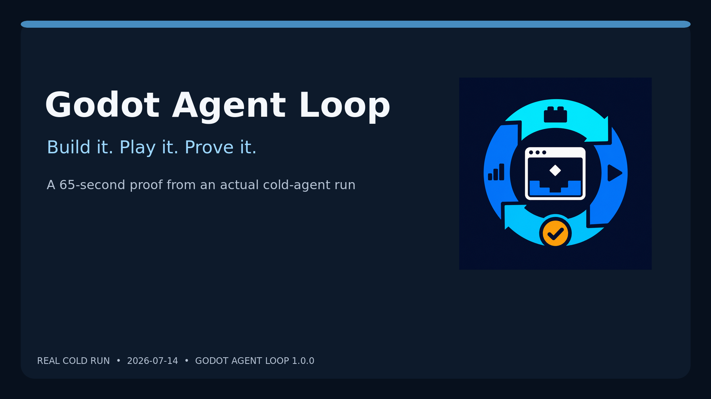
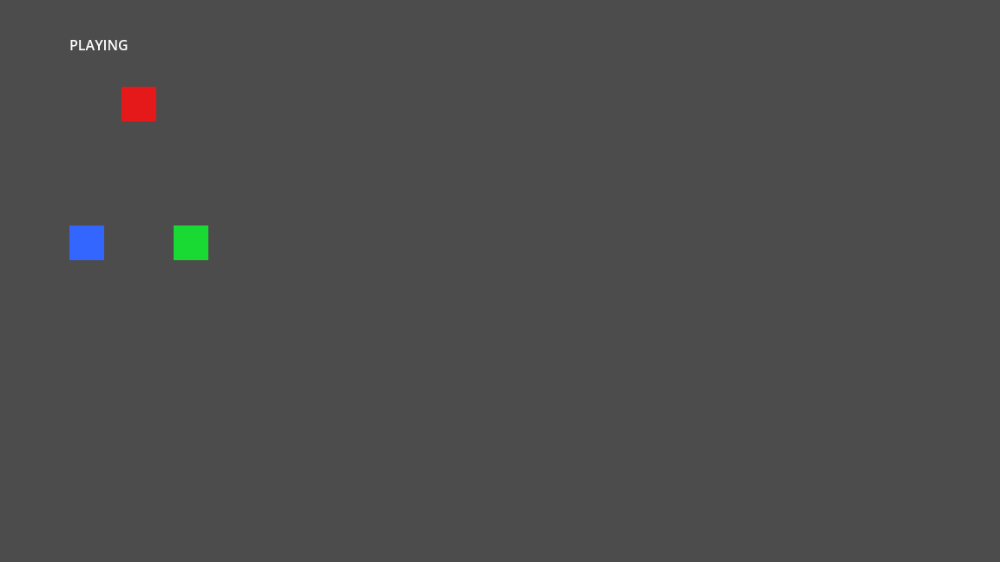
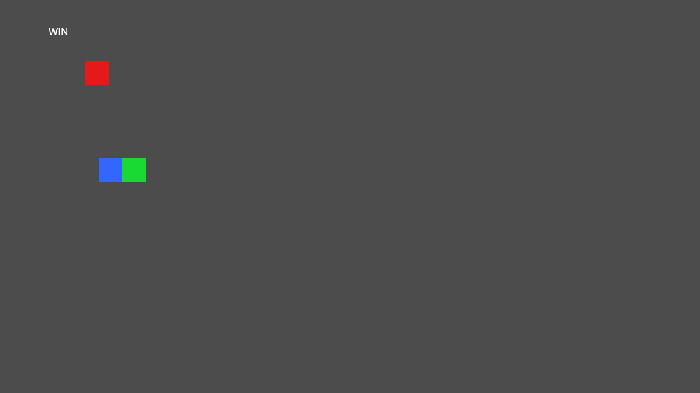

# Godot Agent Loop

**Build it. Play it. Prove it.**

An MCP automation loop for Godot 4.

[](https://www.npmjs.com/package/@beremaran/godot-agent-loop)
[](https://github.com/beremaran/godot-agent-loop/actions/workflows/godot-integration.yml)
<!-- generated-coverage-badge:start -->
[](docs/coverage/coverage-report.md)
<!-- generated-coverage-badge:end -->
[](https://modelcontextprotocol.io/introduction)
[](https://godotengine.org)
[](LICENSE)

Other integrations give agents tools. Godot Agent Loop gives them a tested
feedback loop to author, run, observe, playtest, and independently verify Godot
games:

```text
author → validate → run → observe → playtest → verify → refine
```

[](assets/demo/godot-agent-loop-launch.mp4)

  

[Watch the 65-second demo](assets/demo/godot-agent-loop-launch.mp4) ·
[Read the exact run evidence](docs/launch/launch-evidence.md) ·
[Inspect the resulting project](examples/launch-demo)

## Quickstart

```bash
claude mcp add godot-agent-loop -- npx -y @beremaran/godot-agent-loop
```

Then point the agent at a project directory—or an empty directory—and describe
the playable result. The default `core` surface is kept within the generated
[tool-surface budget](docs/coverage/tool-surface.json). Use read-only
`godot_catalog` to find and inspect a hidden capability, then `godot_call` to
execute it. Runtime injection is transient; watched projects can use the optional
persistent editor addon.

Using Cline, Cursor, or another MCP client? See
[Configuration](#configuration).

## Proof before claims

- Every current tool and public action is traced to resolving tests in the
  source-derived [coverage report](docs/coverage/coverage-report.md); its counts
  and surface sizes are generated rather than copied into prose.
- The complete serial real-Godot matrix is enforced in CI.
- A cold agent built and independently verified a playable win/lose game with
  zero human corrections, in under seven minutes, using 103 MCP calls and no
  built-in tools; see the [launch evidence](docs/launch/launch-evidence.md) and
  [deterministic acceptance record](docs/golden-agent-acceptance.md).
- Privileged reflection, code execution, and networking groups are denied by
  default, and the editor provides a human **Pause Agent** control.

Support is deliberately bounded: Godot 4.7 is both the compatibility floor and
the primary target. Editor attachment is verified on Linux CI and in a headed
macOS 4.7.1 acceptance run; Windows retains the documented portable acceptance
path but not an editor-UI claim. Full debugger automation, native extension
builds, and unbounded engine control are not claimed. Details in the
[verified support boundary](#verified-support-boundary).

## Highlights

- **Author with or without an editor** — attach securely to a normally opened
  project for undoable scene/resource transactions, or retain detached and CI
  authoring with explicit synchronization metadata.
- **Run and observe** — launch the game, capture logs and errors
  incrementally, take screenshots, and run visual-regression comparisons with
  baselines, masks, and retained diffs.
- **Playtest like a player** — mouse, keyboard, key-hold, drag, scroll, touch,
  and gamepad input against the running game.
- **Verify independently** — headless GDScript validation (`validate_script`,
  `validate_scripts`), test runners for native/GUT/GdUnit4
  (`run_project_tests`), bounded runtime evidence (`verify_project`), export
  checks (`verify_export_readiness`), and static integrity analysis
  (`analyze_project_integrity`).
- **Reach into the runtime** — inspect and manipulate any node, signal,
  animation, physics body, or UI control through 100+ runtime tools;
  `game_eval` executes GDScript with `await` support (privileged, opt-in).
- **Drive the editor** — `editor_session ensure` discovers the matching
  project, editor-routed tools and `editor_transaction` apply reversible edits
  through `EditorUndoRedoManager`, and the Agent Activity dock replays the
  bounded correlated trace with a human **Pause Agent** lock.
- **.NET / C# support** — scaffold C# projects with a `Godot.NET.Sdk` matched
  to your installed Godot, generate idiomatic scripts, and restore/build/run
  via `verify_dotnet_project`.
- **Bounded by design** — deterministic pagination and size caps on large
  responses, structured correlated diagnostics, and least-privilege security
  defaults.

## Tool catalog

The full inventory—runtime interaction, scene authoring, project management,
verification, 2D/3D rendering, audio, UI, networking, and more—lives in
[docs/tools.md](docs/tools.md). Per-tool verification status and test references
are in the generated
[coverage report](docs/coverage/coverage-report.md).

## Requirements

- [Godot Engine](https://godotengine.org/download) 4.7 or later
- (Optional) [.NET SDK](https://dotnet.microsoft.com/download) 8.0+ and the
  Godot .NET (C#) build, only if you use `create_project`'s `dotnet: true`
  flag or `create_csharp_script`
- [Node.js](https://nodejs.org/) >= 22.0.0 (active LTS)
- An AI assistant that supports MCP (Claude Code, Cline, Cursor, etc.)

### Godot compatibility policy

Development targets the latest stable Godot release. Godot 4.7 is the current
compatibility floor and primary target, and CI covers that exact release. The
floor may be raised when it blocks useful features or creates meaningful
maintenance cost.
In that case, the last compatible release remains available, and an
older-version maintenance branch will be created only when user demand
justifies maintaining it. Such a branch would receive critical fixes rather
than new features.

### Verified support boundary

| Area | Status | Evidence or limitation |
| --- | --- | --- |
| Linux headed (desktop or Xvfb), Godot 4.7 | Verified in CI | Full MCP E2E under Xvfb, direct runtime, subprocess operations, and strict script parsing |
| GDScript project and running-game workflows | Verified for advertised tools | See the generated [coverage report](docs/coverage/coverage-report.md) |
| Privileged runtime commands | Opt-in only | Disabled by default; intended for trusted localhost development |
| Godot .NET/C# | Scaffold, compile, and editor-load verification | Godot .NET 4.7 with .NET SDK 8 |
| Linux exports | Release/debug template export and smoke-run verification | Godot 4.7 installed templates; other targets are not claimed |
| Rendering and screenshots | A headed rendering context is required | Compatibility and Forward+ on Linux software rendering; display-less sessions fail fast with desktop/Xvfb remediation |
| Windows | Portable acceptance verified | Godot 4.7 process, Unicode path, runtime input, window query, and teardown workflows; editor UI, rendering, and exports are not claimed |
| macOS | Portable acceptance and attached-editor workflow verified | Godot 4.7.1 headed replay opens Godot normally, reconnects the MCP, authors and synchronizes without focus switching/manual reload, exercises undoable transactions, and cleans the discovery record; see the [interactive acceptance record](docs/coverage/interactive-golden-agent-run.json) |
| Editor state and undo/redo bridge | Verified on Linux CI and headed macOS 4.7.1 | Protocol 2 uses private per-project discovery, `EditorInterface`, and `EditorUndoRedoManager`; Windows editor UI remains outside the claimed boundary |
| Full debugger control | Not claimed | Breakpoints, stack inspection, and frame-local evaluation remain outside the supported boundary |
| Profiler, leak, asset, localization, and accessibility audits | Verified in MCP E2E | `game_performance` and `analyze_project_integrity` return bounded live/static evidence; native extension builds remain unsupported |
| GDExtension builds | Not claimed | `analyze_project_integrity` inspects declarations and libraries without invoking arbitrary native toolchains |

## Configuration

The [quickstart](#quickstart) `npx` command is all most setups need. The
sections below cover other clients and a source checkout.

### Interactive editor setup

For a project the user watches, copy
[`addons/godot_agent_loop`](addons/godot_agent_loop) into the project at that
same path, enable **Godot Agent Loop** under **Project > Project Settings >
Plugins**, and restart Godot once. Thereafter Godot may be opened normally;
`editor_session` discovers the matching project without launching a duplicate.
The dock remains visible and waits cleanly when no agent is connected.

The addon publishes a private, untracked record at
`.godot/godot_agent_loop/editor-session.json` with a fresh token and ephemeral
loopback port for each editor start. The token is never returned or logged.
Multiple editors are routed by canonical project path. To uninstall, disable
the plugin, close Godot, remove `addons/godot_agent_loop`, and optionally remove
a stale `.godot/godot_agent_loop` directory. MCP cleanup removes only its own
unmodified transient bridge, never this persistent addon.

An editor already started without an enabled compatible addon cannot receive a
new `EditorPlugin` safely at runtime. Install/enable once and restart. See the
[interaction architecture](docs/architecture/editor-interaction.md) for states,
protocol migration, unsaved-conflict recovery, and fallback semantics.

### Portable agent bundle

The repository ships one neutral bundle that starts the matching npm MCP server
and provides the same build, debug, verify, and ship skills to Claude Code,
Codex, OpenCode, and Pi. For Claude Code:

```text
/plugin marketplace add beremaran/godot-agent-loop
/plugin install godot-agent-loop@godot-agent-loop
```

For a local checkout, use `claude --plugin-dir ./agent-plugin`. See the
[portable agent bundle guide](docs/agent-plugin.md) for verified Claude Code,
Codex, OpenCode, and Pi install paths.

### MCP client configuration

<details>
<summary>Claude Code (manual settings)</summary>

Add to your Claude Code MCP settings:

```json
{
  "mcpServers": {
    "godot": {
      "command": "npx",
      "args": ["-y", "@beremaran/godot-agent-loop"],
      "env": {
        "GODOT_PATH": "/path/to/godot",
        "GODOT_MCP_AUTHORING_MODE": "headless",
        "DEBUG": "true"
      }
    }
  }
}
```

</details>

<details>
<summary>Cline (VS Code)</summary>

Add to your Cline MCP settings (`cline_mcp_settings.json`):

```json
{
  "mcpServers": {
    "godot": {
      "command": "npx",
      "args": ["-y", "@beremaran/godot-agent-loop"],
      "disabled": false
    }
  }
}
```

</details>

<details>
<summary>Cursor</summary>

Create `.cursor/mcp.json` in your project:

```json
{
  "mcpServers": {
    "godot": {
      "command": "npx",
      "args": ["-y", "@beremaran/godot-agent-loop"]
    }
  }
}
```

</details>

For a source checkout, use `node` as the executable and pass the built server
path as a separate argument:

```json
{
  "command": "node",
  "args": ["/absolute/path/to/godot-agent-loop/build/index.js"]
}
```

### Installation from source

```bash
git clone https://github.com/beremaran/godot-agent-loop.git
cd godot-agent-loop
npm install
npm run build
```

## Runtime Tools Setup

No setup is required when the game is started through `run_project`: the server
installs the interaction autoload automatically by generating an `override.cfg`
(which Godot merges over `project.godot` at startup) and copying the runtime
scripts into the project, then removes them again on `stop_project`, game exit,
or server shutdown. `project.godot` is never modified. If an earlier server
crashed or was killed before cleaning up, the next server detects and removes
the leftover files on first contact with the project; an installation you
manage yourself (declared in `project.godot`) is never touched.

To run the interaction server without `run_project`, copy
`build/scripts/mcp_interaction_server.gd` to your project and register it as an
autoload:

1. Copy `build/scripts/mcp_interaction_server.gd` to your project's scripts folder
2. In Godot: **Project > Project Settings > Autoload**
3. Add the script with the name `McpInteractionServer`

The server listens on `127.0.0.1:9090`. Each MCP server launch generates a
cryptographic runtime secret, passes it only to the Godot child process, and
authenticates it during capability negotiation before any runtime command is
accepted. A manually managed runtime should set the same
`GODOT_MCP_RUNTIME_SECRET` value in both processes; leaving it unset retains
legacy unauthenticated behavior and is suitable only for a trusted machine.

Commands that execute arbitrary GDScript, invoke arbitrary node properties or
methods, mutate scripts, call multiplayer peers, or make HTTP/WebSocket
connections remain disabled by default even after authentication. Grant only
the required group with `GODOT_MCP_PRIVILEGED_GROUPS`: `reflection` enables
arbitrary property/method access, `code-execution` enables eval/script control,
and `network` enables RPC, HTTP, and WebSocket. The legacy
`GODOT_MCP_ALLOW_PRIVILEGED_COMMANDS=true` grants all three groups. Use either
only for a trusted local developer workflow. Authentication and policy denials
never echo secrets, source, property values, URLs, headers, or engine errors.
Authentication success/failure emits a structured audit event containing only
the event name, runtime component, numeric session ID, and timestamp.

## Environment Variables

| Variable | Description |
| ---------- | ------------- |
| `GODOT_PATH` | Path to the Godot executable (overrides auto-detection) |
| `DEBUG` | Set to `"true"` for detailed server-side logging. This also runs the headless operations script with `--debug-godot`, which logs diagnostics and writes a temporary write-access probe file into the project (removed again on every branch). Parameter values are summarized by type and size in both logs, never printed. |
| `GODOT_MCP_ALLOWED_DIRS` | Optional. Restrict `run_project` to projects under these roots (`;`, `,`, or `:` separated). When unset, any project path is allowed. |
| `GODOT_MCP_AUTHORING_MODE` | Optional, default `persistent`. `persistent` reuses a headed Godot process and avoids startup cost on each scene or resource call. `headless` opens no helper window and runs each authoring call through its declared one-shot `--headless` subprocess fallback. This does not change the headed `run_project` path. |
| `GODOT_MCP_RUNTIME_SECRET` | Optional explicit shared runtime secret. The MCP server generates a fresh 256-bit value when omitted and passes it only to Godot processes it launches. Set the same value manually only when connecting to a separately launched runtime. |
| `GODOT_MCP_EDITOR_START_PAUSED` | Optional, default `false`. Start the editor addon's cooperative lock in human-editing mode so mutating MCP tools are refused until **Resume Agent** is pressed. |
| `GODOT_MCP_TOOL_SURFACE` | Optional, default `core`. `compact` is a compatibility alias for `core`; `full` advertises the complete static catalog. Unknown values are rejected. Use `godot_catalog` plus `godot_call` for hidden tools; the combined `godot_tools` alias is deprecated through the 1.x release line. |
| `GODOT_MCP_LEGACY_JSON_TEXT` | Optional, default `true`. Set to `false` for clients that read MCP `structuredContent` to omit the extra compatibility JSON text block and reduce repeated output. Bundled adapters set this to `false`. |
| `GODOT_MCP_PRIVILEGED_GROUPS` | Optional comma-separated least-privilege grants: `reflection`, `code-execution`, and/or `network`. All are denied by default. |
| `GODOT_MCP_ALLOW_PRIVILEGED_COMMANDS` | Optional, default `false`. Explicitly enable runtime `eval`, arbitrary property/method access, script control, RPC, HTTP, and WebSocket commands for a trusted localhost developer workflow. |

### Structured runtime evidence

With `DEBUG=true`, the MCP server emits JSON request lifecycle events to
stderr. The Godot runtime emits matching events to its captured stdout. Both
use an internal `mcp_<number>` correlation ID and controlled event fields;
parameters, response values, secrets, source, URLs, and malformed payloads are
never copied into logs. Runtime process output is capped at the latest 1,000
stdout and stderr lines. Stable JSON-RPC error codes remain the authoritative
machine-readable failure classification.

### Large-project response limits

Large responses are bounded rather than allowed to grow with project size.
`list_project_files` returns deterministic cursor pages of at most 1,000 files;
`game_get_scene_tree` returns deterministic pre-order trees of 1,000 nodes by
default (configurable up to 10,000) and reports truncation. `game_get_logs` and
`game_get_errors` return at most 1,000 unread lines per call with `hasMore` and
`remaining`, while retaining the latest 1,000 lines per stream. Runtime JSON
responses are capped at 8 MiB, screenshots additionally enforce pixel and
6 MiB PNG limits, and short-lived subprocess/import commands cap captured output
at 16 MiB. Limit failures are explicit; callers can narrow resource/import
queries instead of receiving partial unlabelled data.

## Architecture

The server uses three bounded execution paths:

1. **Scene and resource authoring** - `GODOT_MCP_AUTHORING_MODE=persistent`
   reuses a headed, deterministic Godot main loop and avoids engine startup cost
   per edit. `GODOT_MCP_AUTHORING_MODE=headless` creates no helper window and
   sends each call to its declared one-shot `--headless` subprocess fallback.

2. **Running-game socket** - `run_project` launches the user's game headed and
   injects the authenticated `mcp_interaction_server.gd` autoload through
   `override.cfg` for high-fidelity runtime interaction.

3. **Other one-shot subprocess work** - Validation, import, and export operations
   may invoke Godot once and exit. Headless authoring does not make visual work
   display-less: running games, screenshots, and visual checks still require a
   desktop display, Xvfb, or another reachable rendering context.

### Source layout

| Path | Description |
| ------ | ------------- |
| `src/index.ts` | MCP server entry point |
| `src/tool-definitions.ts` | Tool names and JSON schemas |
| `src/tool-manifest.ts` | Per-tool domain, backend, and action declarations |
| `src/tool-surface.ts` | Reviewed core membership, discovery ranking, compatibility modes, and generated size budgets |
| `src/tool-handlers/` | Lifecycle, project, and game handler implementations |
| `src/scripts/godot_operations.gd` | Persistent and one-shot GDScript operations runner |
| `src/scripts/mcp_interaction_server.gd` | TCP interaction server autoload |
| `tests/` | Vitest unit, E2E, and Godot suites |

## Testing

The project uses Vitest plus direct Godot and full MCP-to-Godot suites. The
source-derived tool, action, command, and suite inventory is published in the
[coverage report](docs/coverage/coverage-report.md).

```bash
npm run check       # TypeScript tests, lint, build, and coverage drift
npm run test:e2e    # built MCP server through a real client and Godot
npm run test:golden-agent # cold-agent game build acceptance gate
npm run test:godot  # strict parsing, subprocess operations, runtime protocol
npm run test:watch  # watch mode
```

The shipped build, debug, verify, and ship skill scenarios are versioned under
`evals/`. Their committed status is intentionally `not_run` until a deliberate
current-model client run records versioned inputs and schema-valid metrics; the
deterministic golden replay is not presented as a substitute for that run.

## Example Prompts

```text
"Run my Godot project and check for errors"

"Create a new Godot project called 'MyGame' and write a player script"

"Read the test_level.tscn scene and show me the node tree"

"Check all my changed GDScript files for syntax errors before I run the game"

"Hold down the W key for 2 seconds to test walking"

"Pause the game and take a screenshot"

"Get performance metrics - what's my FPS and draw call count?"

"Set the player's health to 100"

"Connect the enemy's 'died' signal to the game manager's 'on_enemy_died' method"

"Create a new C# (.NET) Godot project and add a CharacterBody2D script"
```

## Community

- [Contributing guide](CONTRIBUTING.md) — development workflow, checks, and
  PR expectations
- [Security policy](SECURITY.md) — how to report vulnerabilities
- [Code of conduct](CODE_OF_CONDUCT.md)
- [Changelog](CHANGELOG.md) and
  [release notes](docs/releases)
- [Issues](https://github.com/beremaran/godot-agent-loop/issues) — bug reports
  and feature requests

## License

This project is licensed under the MIT License - see the [LICENSE](LICENSE) file for details.

## Lineage

- **Original project:** [godot-mcp](https://github.com/Coding-Solo/godot-mcp)
  by [Solomon Elias (Coding-Solo)](https://github.com/Coding-Solo), which
  provided the foundational TypeScript MCP server, headless GDScript operations,
  and TCP runtime interaction architecture.
- **Inherited from:** [Tugcan Topaloglu](https://github.com/tugcantopaloglu)'s
  [godot-mcp](https://github.com/tugcantopaloglu/godot-mcp), which extended the
  original project across networking, 3D/2D rendering, UI controls, audio,
  animation, file I/O, runtime code execution, project creation, and physics
  while preserving the MIT license.
- **Godot Agent Loop:** maintained and substantially extended by
  [Berke Arslan](https://github.com/beremaran), preserving the complete Git
  history and every inherited MIT notice.
