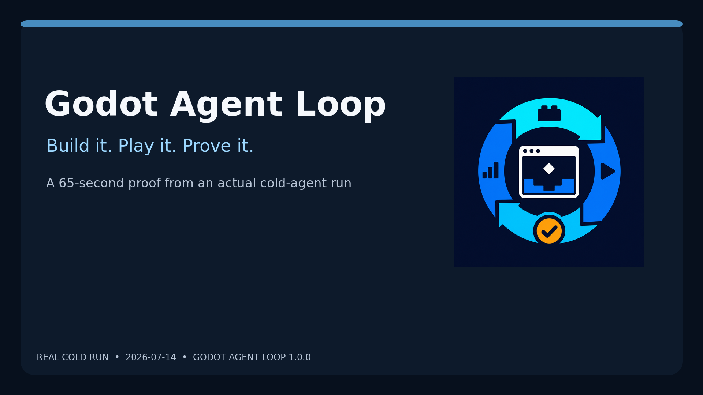
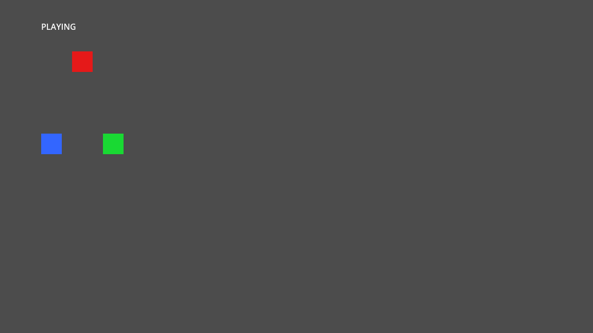

# Godot Agent Loop

**Build it. Play it. Prove it.**

An MCP automation loop for Godot 4.

[](https://www.npmjs.com/package/@beremaran/godot-agent-loop)
[](https://github.com/beremaran/godot-agent-loop/actions/workflows/godot-integration.yml)
[](https://modelcontextprotocol.io/introduction)
[](https://godotengine.org)
[](LICENSE)

Other integrations give agents tools. Godot Agent Loop gives them a
feedback loop to author, run, observe, playtest, and independently verify Godot
games:

```text
author → validate → run → observe → playtest → verify → refine
```

[](assets/demo/godot-agent-loop-launch.mp4)

  

[Watch the 65-second demo](assets/demo/godot-agent-loop-launch.mp4) ·
[Read the exact run evidence](docs/launch/launch-evidence.md) ·
[Inspect the resulting project](examples/launch-demo)

## Quickstart

```bash
claude mcp add godot-agent-loop -- npx -y @beremaran/godot-agent-loop
```

Then point the agent at a project directory—or an empty directory—and describe
the playable result. The default `core` surface is kept within the generated
[tool-surface budget](docs/coverage/tool-surface.json). Use read-only
`godot_catalog` to find and inspect a hidden capability, then `godot_call` to
execute it. Runtime injection is transient; watched projects can use the optional
persistent editor addon.

Using Cline, Cursor, or another MCP client? See
[Configuration](#configuration).

## Proof before claims

- The [evaluation guide](docs/evaluation.md) documents the pinned conformance,
  Inspector, Inspect AI, real-client, scorer, baseline, and paired-comparison
  lanes, including exactly which agent and model each lane uses.
- A retained representative real-Godot path is enforced in CI.
- Historically, a cold agent demonstrated MCP-only operation by building and
  independently verifying a playable win/lose game with zero human corrections
  in under seven minutes, using 103 MCP calls and no built-in tools. That
  launch pre-dates the lean surface reduction, which deliberately removed
  file, scene-authoring, and project-settings tools whose work host editors and
  shells do better; see the [launch evidence](docs/launch/launch-evidence.md)
  and the [changelog](CHANGELOG.md).
- Privileged reflection and code-execution groups are denied by default, and
  the editor provides a human **Pause Agent** control.

Support is deliberately bounded: Godot 4.7 is both the compatibility floor and
the primary target. Editor attachment is verified on Linux CI and in a headed
macOS 4.7.1 acceptance run; Windows retains the documented portable acceptance
path but not an editor-UI claim. Full debugger automation, native extension
builds, and unbounded engine control are not claimed. Details in the
[verified support boundary](#verified-support-boundary).

## Highlights

- **A lean task-oriented core** — the default surface advertises 20 tools that
  cover the whole loop: catalog and dispatch (`godot_catalog`, `godot_call`),
  project facts (`get_project_info`, `get_godot_version`), lifecycle
  (`run_project`, `stop_project`, `get_debug_output`), the editor session and
  compound scene transactions (`editor_session`, `editor_transaction`),
  observation (`game_screenshot`, `game_get_scene_tree`, `game_get_ui`,
  `game_get_node_info`, `game_get_errors`, `game_get_logs`), structured
  interaction and waiting (`game_scenario`, `game_wait_until`), and independent
  verification (`validate_scripts`, `run_project_tests`, `verify_project`).
- **Everything else is one search away** — 44 more tools remain callable through
  `godot_catalog` + `godot_call`: input primitives (mouse, keyboard, key-hold,
  drag, scroll, touch, gamepad), runtime reflection (privileged, opt-in),
  node and signal generics, observation extras (performance, visual regression,
  camera, audio, OS), editor control, and ship tooling (exports, import
  pipeline, .NET, add-ons).
- **Author with your own file tools** — coding agents edit
  `.gd`/`.tscn`/`.tres`/`project.godot` directly and run `validate_scripts` to
  check them; with an editor attached, `editor_transaction` applies undoable
  compound scene edits through `EditorUndoRedoManager`.
- **Run and observe** — launch the game, capture logs and errors
  incrementally, take screenshots, and run visual-regression comparisons with
  baselines, masks, and retained diffs.
- **Playtest like a player** — mouse, keyboard, key-hold, drag, scroll, touch,
  and gamepad input against the running game, composed deterministically with
  `game_scenario`.
- **Verify independently** — headless GDScript validation (`validate_scripts`),
  test runners for native/GUT/GdUnit4 (`run_project_tests`), bounded runtime
  evidence (`verify_project`), export checks (`verify_export_readiness`), and
  static integrity analysis (`analyze_project_integrity`).
- **Reach into the runtime** — with `reflection` and `code-execution` opted in,
  inspect and manipulate any node, signal, or property through `game_eval` and
  the generic node tools.
- **Drive the editor** — `editor_session ensure` discovers the matching
  project, `editor_transaction` applies reversible edits through
  `EditorUndoRedoManager`, and the Agent Activity dock replays the bounded
  correlated trace with a human **Pause Agent** lock.
- **.NET / C# support** — inspect, restore, build, and run .NET projects with a
  `Godot.NET.Sdk` matched to your installed Godot via `verify_dotnet_project`.
- **Bounded by design** — deterministic pagination and size caps on large
  responses, structured correlated diagnostics, and least-privilege security
  defaults.

## Tool catalog

The full inventory—the 20 advertised core tools plus the hidden catalog of 44
more—lives in [docs/tools.md](docs/tools.md).

## Requirements

- [Godot Engine](https://godotengine.org/download) 4.7 or later
- (Optional) [.NET SDK](https://dotnet.microsoft.com/download) 8.0+ and the
  Godot .NET (C#) build, only if you use `verify_dotnet_project`
- [Node.js](https://nodejs.org/) >= 22.0.0 (active LTS)
- An AI assistant that supports MCP (Claude Code, Cline, Cursor, etc.)

### Godot compatibility policy

Development targets the latest stable Godot release. Godot 4.7 is the current
compatibility floor and primary target, and CI covers that exact release. The
floor may be raised when it blocks useful features or creates meaningful
maintenance cost.
In that case, the last compatible release remains available, and an
older-version maintenance branch will be created only when user demand
justifies maintaining it. Such a branch would receive critical fixes rather
than new features.

### Verified support boundary

| Area | Status | Evidence or limitation |
| --- | --- | --- |
| Linux headed (desktop or Xvfb), Godot 4.7 | Verified in CI | Retained MCP E2E under Xvfb covers representative authoring, runtime, editor attachment, and teardown paths |
| GDScript project and running-game workflows | Representative coverage retained | Scene creation, runtime mutation, process ownership, security, and editor discovery remain in the E2E smoke suite |
| Privileged runtime commands | Opt-in only | Disabled by default; intended for trusted localhost development |
| Godot .NET/C# | Scaffold, compile, and editor-load verification | Godot .NET 4.7 with .NET SDK 8 |
| Linux exports | Release/debug template export and smoke-run verification | Godot 4.7 installed templates; other targets are not claimed |
| Rendering and screenshots | A headed rendering context is required | Compatibility and Forward+ on Linux software rendering; display-less sessions fail fast with desktop/Xvfb remediation |
| Windows | Portable acceptance verified | Godot 4.7 process, Unicode path, runtime input, window query, and teardown workflows; editor UI, rendering, and exports are not claimed |
| macOS | Portable acceptance and attached-editor workflow verified | Godot 4.7.1 headed replay opens Godot normally, reconnects the MCP, authors and synchronizes without focus switching/manual reload, exercises undoable transactions, and cleans the discovery record; see the [interactive acceptance record](docs/coverage/interactive-golden-agent-run.json) |
| Editor state and undo/redo bridge | Verified on Linux CI and headed macOS 4.7.1 | Protocol 2 uses private per-project discovery, `EditorInterface`, and `EditorUndoRedoManager`; Windows editor UI remains outside the claimed boundary |
| Full debugger control | Not claimed | Breakpoints, stack inspection, and frame-local evaluation remain outside the supported boundary |
| Profiler, leak, asset, localization, and accessibility audits | Verified in MCP E2E | `game_performance` and `analyze_project_integrity` return bounded live/static evidence; native extension builds remain unsupported |
| GDExtension builds | Not claimed | `analyze_project_integrity` inspects declarations and libraries without invoking arbitrary native toolchains |

## Configuration

The [quickstart](#quickstart) `npx` command is all most setups need. The
sections below cover other clients and a source checkout.

### Interactive editor setup

For a project the user watches, copy
[`addons/godot_agent_loop`](addons/godot_agent_loop) into the project at that
same path, enable **Godot Agent Loop** under **Project > Project Settings >
Plugins**, and restart Godot once. Thereafter Godot may be opened normally;
`editor_session` discovers the matching project without launching a duplicate.
The dock remains visible and waits cleanly when no agent is connected.

The addon publishes a private, untracked record at
`.godot/godot_agent_loop/editor-session.json` with a fresh token and ephemeral
loopback port for each editor start. The token is never returned or logged.
Multiple editors are routed by canonical project path. To uninstall, disable
the plugin, close Godot, remove `addons/godot_agent_loop`, and optionally remove
a stale `.godot/godot_agent_loop` directory. MCP cleanup removes only its own
unmodified transient bridge, never this persistent addon.

An editor already started without an enabled compatible addon cannot receive a
new `EditorPlugin` safely at runtime. Install/enable once and restart. See the
[interaction architecture](docs/architecture/editor-interaction.md) for states,
protocol migration, unsaved-conflict recovery, and fallback semantics.

### Portable agent bundle

The repository ships one neutral bundle that starts the matching npm MCP server
and provides the same build, debug, verify, and ship skills to Claude Code,
Codex, OpenCode, and Pi. For Claude Code:

```text
/plugin marketplace add beremaran/godot-agent-loop
/plugin install godot-agent-loop@godot-agent-loop
```

For a local checkout, use `claude --plugin-dir ./agent-plugin`. See the
[portable agent bundle guide](docs/agent-plugin.md) for verified Claude Code,
Codex, OpenCode, and Pi install paths.

### MCP client configuration

<details>
<summary>Claude Code (manual settings)</summary>

Add to your Claude Code MCP settings:

```json
{
  "mcpServers": {
    "godot": {
      "command": "npx",
      "args": ["-y", "@beremaran/godot-agent-loop"],
      "env": {
        "GODOT_PATH": "/path/to/godot",
        "DEBUG": "true"
      }
    }
  }
}
```

</details>

<details>
<summary>Cline (VS Code)</summary>

Add to your Cline MCP settings (`cline_mcp_settings.json`):

```json
{
  "mcpServers": {
    "godot": {
      "command": "npx",
      "args": ["-y", "@beremaran/godot-agent-loop"],
      "disabled": false
    }
  }
}
```

</details>

<details>
<summary>Cursor</summary>

Create `.cursor/mcp.json` in your project:

```json
{
  "mcpServers": {
    "godot": {
      "command": "npx",
      "args": ["-y", "@beremaran/godot-agent-loop"]
    }
  }
}
```

</details>

For a source checkout, use `node` as the executable and pass the built server
path as a separate argument:

```json
{
  "command": "node",
  "args": ["/absolute/path/to/godot-agent-loop/build/index.js"]
}
```

### Installation from source

```bash
git clone https://github.com/beremaran/godot-agent-loop.git
cd godot-agent-loop
npm install
npm run build
```

## Runtime Tools Setup

No setup is required when the game is started through `run_project`: the server
installs the interaction autoload automatically by generating an `override.cfg`
(which Godot merges over `project.godot` at startup) and copying the runtime
scripts into the project, then removes them again on `stop_project`, game exit,
or server shutdown. `project.godot` is never modified. If an earlier server
crashed or was killed before cleaning up, the next server detects and removes
the leftover files on first contact with the project; an installation you
manage yourself (declared in `project.godot`) is never touched.

To run the interaction server without `run_project`, copy
`build/scripts/mcp_interaction_server.gd` to your project and register it as an
autoload:

1. Copy `build/scripts/mcp_interaction_server.gd` to your project's scripts folder
2. In Godot: **Project > Project Settings > Autoload**
3. Add the script with the name `McpInteractionServer`

The server listens on `127.0.0.1:9090`. Each MCP server launch generates a
cryptographic runtime secret, passes it only to the Godot child process, and
authenticates it during capability negotiation before any runtime command is
accepted. A manually managed runtime should set the same
`GODOT_MCP_RUNTIME_SECRET` value in both processes. A runtime without a shared
secret refuses unauthenticated sessions unless `GODOT_MCP_ALLOW_INSECURE_RUNTIME`
is set explicitly; use that only on a trusted machine.

Commands that execute arbitrary GDScript or invoke arbitrary node properties or
methods remain disabled by default even after authentication. Grant only the
required group with `GODOT_MCP_PRIVILEGED_GROUPS`: `reflection` enables
arbitrary property/method access and `code-execution` enables eval/script
control. The legacy `GODOT_MCP_ALLOW_PRIVILEGED_COMMANDS=true` grants both
groups. Use either only for a trusted local developer workflow. Authentication
and policy denials never echo secrets, source, property values, URLs, headers,
or engine errors.
Authentication success/failure emits a structured audit event containing only
the event name, runtime component, numeric session ID, and timestamp.

## Environment Variables

| Variable | Description |
| ---------- | ------------- |
| `GODOT_PATH` | Path to the Godot executable (overrides auto-detection) |
| `DEBUG` | Set to `"true"` for detailed server-side logging. This also runs the headless operations script with `--debug-godot`, which logs diagnostics and writes a temporary write-access probe file into the project (removed again on every branch). Parameter values are summarized by type and size in both logs, never printed. |
| `GODOT_MCP_ALLOWED_DIRS` | Optional. Restrict `run_project` to projects under these roots (`;`, `,`, or `:` separated). When unset and no MCP client roots are provided, filesystem access is denied unless `GODOT_MCP_ALLOW_UNRESTRICTED` is set. |
| `GODOT_MCP_HEADLESS` | Optional, default `false`. Set to `true` (or `1`) to run `run_project` and `launch_editor` with Godot's `--headless` flag so no window opens. Rendering-dependent operations such as screenshots fail fast with a headed-display remediation; intended for CI and headless workstations. The E2E suite honors it too: `GODOT_MCP_HEADLESS=1 npm run test:e2e` skips its pixel assertions, which stay covered by the virtual-display renderer jobs. |
| `GODOT_MCP_RUNTIME_SECRET` | Optional explicit shared runtime secret. The MCP server generates a fresh 256-bit value when omitted and passes it only to Godot processes it launches. Set the same value manually only when connecting to a separately launched runtime. |
| `GODOT_MCP_EDITOR_START_PAUSED` | Optional, default `false`. Start the editor addon's cooperative lock in human-editing mode so mutating MCP tools are refused until **Resume Agent** is pressed. |
| `GODOT_MCP_TOOL_SURFACE` | Optional, default `core`. `compact` is a compatibility alias for `core`; `full` advertises the complete 64-tool static catalog. Unknown values are rejected. Use `godot_catalog` plus `godot_call` for hidden tools. |
| `GODOT_MCP_LEGACY_JSON_TEXT` | Optional, default `true`. Set to `false` for clients that read MCP `structuredContent` to omit the extra compatibility JSON text block and reduce repeated output. Bundled adapters set this to `false`. |
| `GODOT_MCP_PRIVILEGED_GROUPS` | Optional comma-separated least-privilege grants: `reflection` and/or `code-execution`. All are denied by default. |
| `GODOT_MCP_ALLOW_PRIVILEGED_COMMANDS` | Optional, default `false`. Explicitly enable runtime `eval`, arbitrary property/method access, and script control for a trusted localhost developer workflow. |
| `GODOT_MCP_ALLOW_UNRESTRICTED` | Optional, default `false`. Explicitly re-enable the legacy open path mode when neither `GODOT_MCP_ALLOWED_DIRS` nor MCP client roots are configured. Without roots and without this flag, filesystem access is denied. |
| `GODOT_MCP_ALLOW_INSECURE_RUNTIME` | Optional, default `false`. Set in the Godot runtime process to restore the legacy unauthenticated handshake for a separately launched runtime that cannot receive `GODOT_MCP_RUNTIME_SECRET`. Keep off whenever the runtime can receive the shared secret. |

### Structured runtime evidence

With `DEBUG=true`, the MCP server emits JSON request lifecycle events to
stderr. The Godot runtime emits matching events to its captured stdout. Both
use an internal `mcp_<number>` correlation ID and controlled event fields;
parameters, response values, secrets, source, URLs, and malformed payloads are
never copied into logs. Runtime process output is capped at the latest 1,000
stdout and stderr lines. Stable JSON-RPC error codes remain the authoritative
machine-readable failure classification.

### Large-project response limits

Large responses are bounded rather than allowed to grow with project size.
`game_get_scene_tree` returns deterministic pre-order trees of 1,000 nodes by
default (configurable up to 10,000) and reports truncation, and
`game_get_ui` bounds visible controls. `game_get_logs` and
`game_get_errors` return at most 1,000 unread lines per call with `hasMore` and
`remaining`, while retaining the latest 1,000 lines per stream. Runtime JSON
responses are capped at 8 MiB, screenshots additionally enforce pixel and
6 MiB PNG limits, and short-lived subprocess/import commands cap captured output
at 16 MiB. Limit failures are explicit; callers can narrow resource/import
queries instead of receiving partial unlabelled data.

## Architecture

The server uses three bounded execution paths:

1. **Scene and resource authoring** - coding agents are expected to author
   `.gd`/`.tscn`/`.tres`/`project.godot` with their own file tools. When a
   compatible editor session is attached, `editor_transaction` applies compound
   scene edits as one undo step through `EditorUndoRedoManager`; detached and
   CI projects are authored directly on disk.

2. **Running-game socket** - `run_project` launches the user's game headed and
   injects the authenticated `mcp_interaction_server.gd` autoload through
   `override.cfg` for high-fidelity runtime interaction.

3. **Other one-shot subprocess work** - Validation, import, and export operations
   may invoke Godot once and exit. Running games, screenshots, and visual checks
   still require a desktop display, Xvfb, or another reachable rendering context.

### Source layout

| Path | Description |
| ------ | ------------- |
| `src/index.ts` | MCP server entry point |
| `src/tool-definitions.ts` | Tool names and JSON schemas |
| `src/tool-manifest.ts` | Per-tool domain, backend, and action declarations |
| `src/tool-surface.ts` | Reviewed core membership, discovery ranking, compatibility modes, and generated size budgets |
| `src/tool-handlers/` | Lifecycle, project, and game handler implementations |
| `src/scripts/mcp_interaction_server.gd` | TCP interaction server autoload |
| `tests/` | Retained Vitest unit and MCP-to-Godot smoke suites |

## Testing

The project uses Vitest for a deliberately small unit and MCP-to-Godot smoke
suite.

```bash
npm run check       # lint, build, and retained unit suite
npm run test:e2e    # built MCP server through a real client and Godot
npm run test:e2e:docker # same suite inside a containerized xvfb+Godot 4.7 environment,
                        # so no Godot windows open on the host; use -- to pass file filters
npm run test:watch  # watch mode
```

Every `npm run test:e2e` run ends with an `[e2e-metrics]` summary of wall-clock
time and MCP/Godot startup counts, so suite overhead can be compared across
runs and CI jobs. The containerized runner (`scripts/run-e2e-docker.sh`, image
built from `tests/e2e/docker/Dockerfile`) mirrors the primary Godot 4.7 CI job:
Ubuntu + xvfb + the official Godot build, with `node_modules` kept in a named
volume so the host install is never touched.

The shipped build, debug, verify, and ship skill scenarios are versioned under
`evals/`. Their committed status is intentionally `not_run` until a deliberate
current-model client run records versioned inputs and schema-valid metrics; the
deterministic golden replay is not presented as a substitute for that run.

## Example Prompts

```text
"Author scripts/player.gd and scenes/level.tscn with your file tools, then run
validate_scripts before launching"

"Run my Godot project and check for errors with game_get_errors"

"Check all my changed GDScript files for syntax errors before I run the game"

"Run the project, wait until the main menu is up, and take a screenshot"

"Hold down the W key for 2 seconds to test walking (find game_key_hold in the
catalog)"

"Run a game_scenario that presses Enter on the title screen and asserts the
scene changed to res://scenes/level.tscn"

"Use verify_project to run bounded assertions and capture evidence"

"Sample performance - what's my FPS and draw call count? (game_performance)"

"Export the project for Linux with verify_export_readiness"

"Restore, build, and run the .NET project with verify_dotnet_project"
```

## Community

- [Contributing guide](CONTRIBUTING.md) — development workflow, checks, and
  PR expectations
- [Security policy](SECURITY.md) — how to report vulnerabilities
- [Code of conduct](CODE_OF_CONDUCT.md)
- [Changelog](CHANGELOG.md) and
  [release notes](docs/releases)
- [Issues](https://github.com/beremaran/godot-agent-loop/issues) — bug reports
  and feature requests

## License

This project is licensed under the MIT License - see the [LICENSE](LICENSE) file for details.

## Lineage

- **Original project:** [godot-mcp](https://github.com/Coding-Solo/godot-mcp)
  by [Solomon Elias (Coding-Solo)](https://github.com/Coding-Solo), which
  provided the foundational TypeScript MCP server, headless GDScript operations,
  and TCP runtime interaction architecture.
- **Inherited from:** [Tugcan Topaloglu](https://github.com/tugcantopaloglu)'s
  [godot-mcp](https://github.com/tugcantopaloglu/godot-mcp), which extended the
  original project across networking, 3D/2D rendering, UI controls, audio,
  animation, file I/O, runtime code execution, project creation, and physics
  while preserving the MIT license.
- **Godot Agent Loop:** maintained and substantially extended by
  [Berke Arslan](https://github.com/beremaran), preserving the complete Git
  history and every inherited MIT notice.
