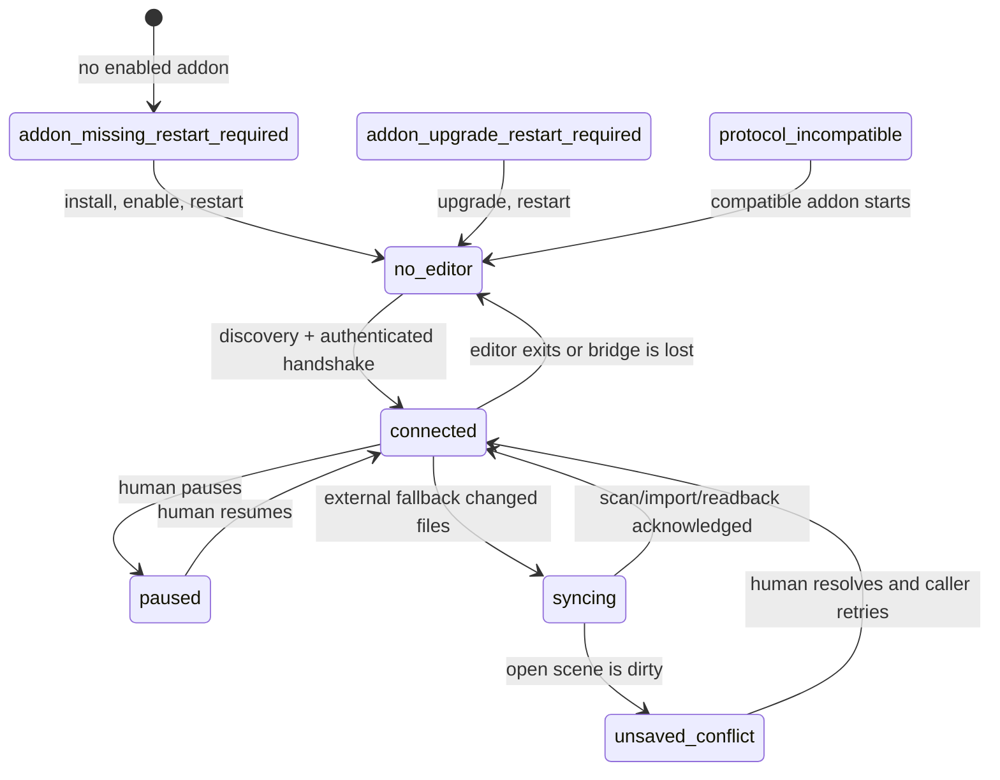

# ADR: interactive editor attachment and authoring

Status: accepted for the protocol 2 editor bridge.

## Decision

Godot Agent Loop supports three modes. They share project tools but have
different state ownership and evidence requirements.

| Mode | Owner of mutable state | Primary backend | Required evidence |
| --- | --- | --- | --- |
| Attached editor authoring | The user's open Godot editor | Authenticated `EditorPlugin` transaction | Editor acknowledgement plus independent persisted readback |
| Detached/headless authoring | Project files and an MCP-owned authoring process | Authoring session, then declared subprocess fallback when startup is unavailable | Process result; `sync_status=detached` when no editor can acknowledge it |
| Running-game interaction | The launched game process | Authenticated runtime JSON-RPC | Runtime observation/assertion and deterministic teardown |

Attached authoring is preferred when a compatible session exists. It does not
replace detached authoring, CI, or intentionally procedural projects. A
realtime watched run and deterministic verification are separate timing modes.

## Editor session state machine

Sessions are keyed by the canonical project path. The public states are:

| State | Meaning and safe next action |
| --- | --- |
| `connected` | The matching editor authenticated and accepts commands. |
| `no_editor` | A compatible addon is installed, but no matching editor has published a live session. Open Godot normally or use an explicit launch request. |
| `addon_missing_restart_required` | The persistent addon is absent or disabled. Install/enable it once, then restart Godot. An `EditorPlugin` cannot be injected safely into an editor that is already running. |
| `addon_upgrade_restart_required` | The installed addon predates the required bridge protocol. Replace it and restart Godot. |
| `protocol_incompatible` | A live discovery record or authenticated handshake uses an incompatible protocol. No commands are sent. |
| `paused` | The human selected **Pause Agent**. Observation remains allowed; persistent mutation is rejected before dispatch. |
| `syncing` | A bounded scan/import/reload/readback acknowledgement is in progress. |
| `unsaved_conflict` | Reloading would overwrite unsaved human edits. Save, discard, or move the human change explicitly, then retry. |

Discovery is Godot-first or MCP-first. The addon binds an ephemeral loopback
port, creates a fresh 256-bit token at every editor start, and atomically writes
`.godot/godot_agent_loop/editor-session.json`. The private record includes the
canonical project, PID and start identity, port, token, bridge/addon/Godot
versions, and creation time. The server validates permissions where supported,
PID, project identity, loopback routing, protocol, and the authenticated
handshake. Tokens are never returned, logged, traced, or copied elsewhere.
Stale records are removed. A bounded watcher and reconnect backoff support an
editor that starts later or survives an MCP restart. Multiple project editors
remain isolated by canonical path.

The transitions are:

## Public session contract

`editor_session` requires `projectPath` and an action:

- `ensure` discovers and authenticates first. It is idempotent and does not
  launch unless `launchIfNeeded=true`.
- `status` performs non-mutating discovery and returns the current state.
- `disconnect` closes only the MCP connection; it does not stop the editor or
  remove a persistent addon.

The response contains `editor_session` with `state`, canonical `project_path`,
`connected`, `reused`, `spawned`, PID/start identity, loopback port, protocol,
addon/Godot versions, creation time, and an optional actionable `reason`.
Authentication material is deliberately absent. `launch_editor` uses the same
ensure flow, reuses a compatible editor, and waits for a confirmed bridge. Its
transient addon is reserved for a disposable MCP-owned launch and is removed
only if the same MCP installed it and its files remain unmodified.

## Authoring routing and mutation results

The following existing tools route to one `EditorUndoRedoManager` transaction
when attached: `create_scene`, `add_node`, `modify_scene_node`,
`remove_scene_node`, `attach_script`, `save_scene` (except save-as), and
`manage_scene_structure` rename/duplicate/move. Common engine resource classes
(materials, meshes, 2D/3D shapes, themes, audio streams, gradients, curves, and
environments) also route through `create_resource` and `manage_resource`
modify. `editor_transaction` exposes
compound add/remove/rename/duplicate/reparent/property/instantiate/script/
resource-assignment/save operations directly. The transaction validates every
stage before commit, records one human-readable undo action, saves, and reloads
the packed scene independently for hierarchy evidence.

Creating a previously absent scene requires one isolated initial `PackedScene`
save before Godot can open it. Save-only and initial creation therefore report
`undo_recorded=false`; structural stages remain one undo step. Initial resource
creation has the same disclosed save fallback, while edits to an existing
supported resource are one undo action. Unsupported resource types, save-as,
project settings, scripts, imported source assets, and
other project-file operations retain their declared file-backed implementation
and then enter the acknowledged synchronization queue. Additional resource
families can be staged without changing the session contract.

Every persistent mutation result distinguishes persistence from editor
visibility with these fields:

| Field | Contract |
| --- | --- |
| `backend` | `editor`, `authoring-session`, or the declared file/subprocess backend |
| `editor_session` | Public session snapshot, or `null` when unavailable |
| `sync_status` | `acknowledged`, `detached`, `timeout`, `conflict`, or `failed` |
| `fallback_reason` | `null` for editor-native work; otherwise the explicit reason |
| `observed_target_state` | Independent persisted/editor readback, or `null` when it could not be observed |

Once a request may have reached an editor or authoring process, transport or
validation failure is returned without replaying the mutation through another
backend. This avoids duplicate partial writes.

## External synchronization

File-backed mutations are serialized per project and debounced. The final
scene/resource and focus target are retained. The addon starts an editor
filesystem scan, waits for scan/import completion, refuses to reload a dirty
open scene, reloads only when safe, restores/reveals supported context, and
returns open scene, selection, import, focus, and readback observations.
Persistence can succeed with `sync_status=detached`; it cannot claim editor
visibility. A timeout, disconnect, focus failure, or conflict remains visible
in both the tool result and the correlated activity trace. Focus switching and
blind **Reload from disk** are not recovery steps in the normal contract.

Synchronization evidence varies by file family because Godot exposes different
public editor APIs:

| Changed file | Acknowledged editor behavior | Remaining limitation |
| --- | --- | --- |
| Open scene text | Scan, dirty-state check, safe reload, selection/focus restoration, and independent scene visibility readback | A dirty scene returns `unsaved_conflict`; it is never overwritten |
| Script | Scan/import completion and resource visibility readback; an attached-scene focus target is restored when supplied | Script-editor caret/tab restoration is not available through the public API |
| Imported source asset | Scan/import completion plus imported-resource visibility | Importer-specific progress detail and inspector focus are limited to the filesystem API |
| External resource | Scan completion, resource visibility, and attached-node focus when supplied | Unsupported resource classes remain file-backed and disclose the fallback |
| Project settings | Project-file persistence plus completed filesystem scan/readback acknowledgement | Godot does not expose a general safe live reload for every project setting; restart-required settings remain restart-required |

The result never upgrades these bounded observations into a stronger claim. In
particular, `sync_status=acknowledged` for project settings means the editor
observed the completed filesystem synchronization, not that every subsystem
re-read a restart-sensitive setting.

## Compatibility and migration

Editor bridge protocol 2 replaces the fixed-port, shared-secret transient
bridge. Protocol 1 discovery/session records are rejected rather than guessed.
A persistent protocol 1 addon must be replaced and Godot restarted. A legacy
MCP-owned transient addon is removed only when its ownership marker and hashes
still match; user-managed files are never overwritten or removed. Runtime
JSON-RPC remains protocol 1 and is independent from this editor bridge change.

The persistent addon is optional. Projects that do not install it retain
headless authoring, CI, runtime interaction, and deterministic verification.
