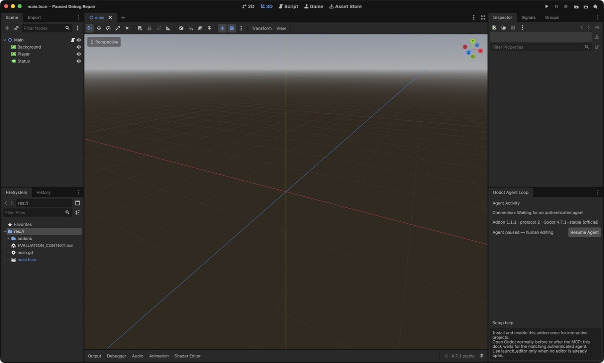

# Godot Agent Loop 1.0 launch evidence

This is a historical 1.0.0 evidence record. Tool counts and observed selection
failures remain unchanged because they describe that exact run, not the current
generated core surface.

## Current Activity and human-control evidence

On 2026-07-17, Godot 4.7.1 loaded the packaged 1.1.1 add-on in a disposable
watched project. The Activity dock began in **Agent paused — human editing**
with **Resume Agent**, changed to **Agent is driving** with **Pause Agent** after
the human control was activated, and returned to paused on the next activation.
The editor process and disposable project were then removed through the owned
evaluation cleanup path.

The launch proof is a measured cold-agent run plus a deterministic replay. The
65-second edit is available as the
[launch video](../../assets/demo/godot-agent-loop-launch.mp4), and its source
evidence is recorded in
[`launch-agent-run.json`](../coverage/launch-agent-run.json).

## Exact cold run

| Field | Value |
| --- | --- |
| Date | 2026-07-14 |
| Client | Claude Code 2.1.208 |
| Model | Claude Sonnet 5 (`claude-sonnet-5`) |
| Effort | high |
| Server | Godot Agent Loop 1.0.0, source commit `8ed358c1d050f5e333cb5af22dad9194e29de530` |
| Godot | 4.7 stable, official build `5b4e0cb0f` |
| Starting state | empty allowed directory |
| Available tools | the 39-tool core MCP surface; built-in tools and plugin skills disabled |
| Human corrections | 0 |
| Elapsed time | 391.795 seconds |
| Model turns | 104 |
| Tool use | 103 MCP calls across 25 tools; 0 non-MCP calls |

The literal input is preserved byte-for-byte in
[`agent-prompt.txt`](agent-prompt.txt) with SHA-256
`8342b494fe1e9027f92328026dcd1dffccda322c9f5c6528140f5853a842be1d`.
The MCP process was restricted to `/tmp/godot-agent-loop-launch-1.0.0`, and
`GODOT_PATH` selected the official 4.7 executable. No prior project files
existed at the requested path.

The successful agent-authored result is preserved under
[`examples/launch-demo`](../../examples/launch-demo). After the MCP process
closed, the project contained exactly `project.godot`, `scenes/Main.tscn`,
`scripts/Main.gd`, and its Godot UID. No running Godot process, transient addon,
ownership marker, or `override.cfg` remained.

## Observed proof

The agent opened the editor before authoring. It then created the scene and typed
script, registered D/`move_right` and L/`lose`, validated the script, set the
main scene, and opened it in the editor. The first runtime observation exposed
that its array-shaped Vector2/Color arguments had produced zeroed controls. The
agent diagnosed that through live node inspection, repaired the values with
object-shaped variants, and independently reread the scene.

It then proved:

- PLAYING through live UI, log output, and a 1152×648 rendered screenshot;
- WIN in a clean run through UI, logs, and the rendered player/goal overlap;
- LOSE in a separate clean run through UI, logs, and an unmoved player; and
- a fresh `verify_project` run with 5/5 assertions, screenshot SHA-256
  `4e1a66b8fb3891f7f06208bf96b9df12affba19fdb8bd15706ef1910d351cb89`,
  `stopped: true`, and `teardown: true`.

The run also preserved a real selection miss: it sent 33 `game_key_press` calls
instead of searching `godot_tools` for hidden `game_key_hold`. That inefficiency
is reported in the video and machine-readable record rather than edited out.

## Video integrity and replay

`npm run launch:video` reproducibly builds the 1920×1080 H.264 edit from the
three cold-run screenshots and the real headed editor/addon captures. The video
is 65 seconds long. Its Pause Agent segment uses the reproducible real-addon
capture that proves a human pause blocks mutation while inspection remains
available. It is deliberately separate from the zero-correction cold run: a
human clicking Pause during that run would invalidate the no-intervention claim.

The edit condenses the 391.795-second run; it is not presented as an uncut screen
recording or a recreation of model reasoning. Only tool-visible outcomes and
measured metadata are included. The private raw model stream is not published.

Run `npm run test:golden-agent` to replay the authored MCP path against a real
Godot process and independently assert scene files, input, PLAYING/WIN/LOSE
state, rendered pixels, and teardown. Run `npm run launch:video` to rebuild the
edited proof from the committed media.
